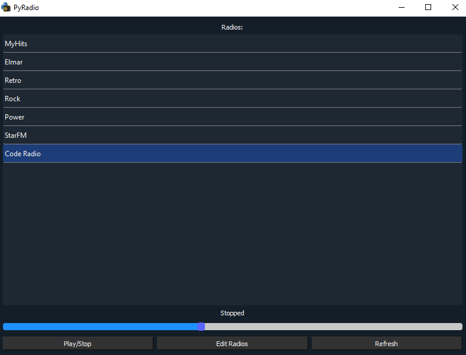

# PyRadio
Simple GUI for streaming internet radios using VLC, python-vlc and Qt for Python.

**Doesn't support MacOS because of a permissions problem**

### Installation

- Run the following commands:

```
git clone https://github.com/LordzShadow/PyRadio.git
cd PyRadio
pip install -r requirements.txt
```
- You also need VLC Media Player 32- or 64-bit depending on your Python version.

### Usage

- To add radios open radios.txt and following the syntax add the name and URL
- `<Name of radio>:<URL to stream>`
- Run main.py, choose your radio and press Play!

- Supports media key usage
- Minimize button minimizes to tray if possible
- Volume slider to control VLC volume

- **If you want to run without console on Windows, change main.py to main.pyw**

### Executable file for windows
- To run the program, run PyRadio.exe in dist folder.(YOU NEED THE WHOLE DIST FOLDER)
- (not sure if you need anything else)
- radios.txt is also in the dist folder if you want to edit it without using the program.




